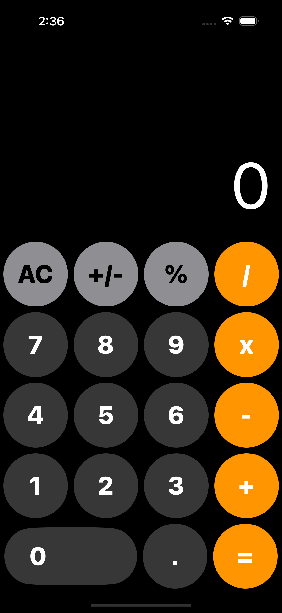
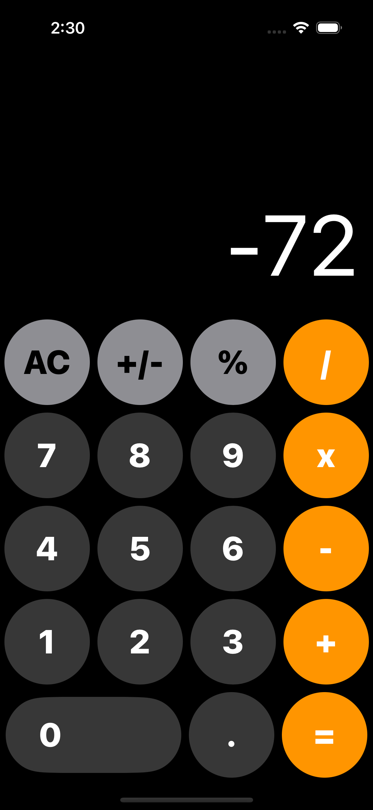
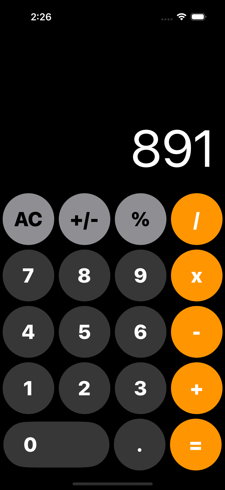

# Calculator

Calculator is a simple iOS app built using SwiftUI that replicates the functionality of the built-in iPhone calculator. Users can perform basic arithmetic operations such as addition, subtraction, multiplication, and division, as well as calculate percentages.

    
    
    

## Features

- **Basic Arithmetic Operations**: Users can perform addition, subtraction, multiplication, and division operations.
- **Percentage Calculation**: Users can calculate percentages of numbers.
- **Clear and Reset**: The app provides options to clear the input or reset the entire calculation.
- **Dynamic Interface**: The user interface adjusts dynamically based on user input and the current state of the calculation.

## Technologies Used

- **SwiftUI**: Used for building the user interface of the app.
- **Swift**: The programming language used to implement the app logic.
- **Xcode**: The integrated development environment used for iOS app development.

## Getting Started

To run this project locally, you'll need:

- Xcode installed on your Mac.
- Clone this repository to your local machine.
- Open the project in Xcode.
- Build and run the project on a simulator or your iOS device.

## Future Improvements

- **Scientific Calculator Functions**: Implement advanced mathematical functions such as trigonometric functions, exponentiation, and logarithms.
- **History of Calculations**: Provide a history of calculations performed by the user.
- **Customizable Theme**: Allow users to customize the appearance of the calculator interface.
